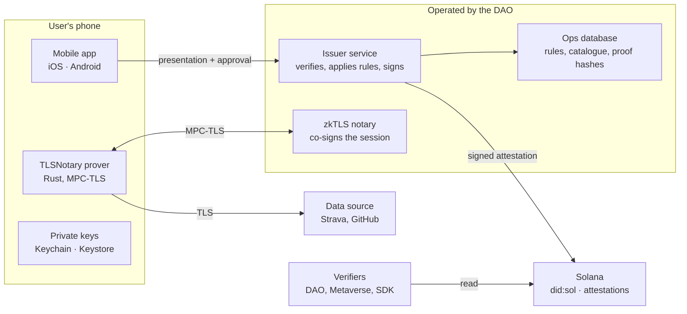

# Smart-SSI architecture

How Smart-SSI is built: what runs on the phone, what the DAO operates, what lives on Solana. It follows the [white paper](README.md) and the [roadmap](ROADMAP.md). Choices are for phase 1 and will be revisited at each phase.

Smart-SSI depends on no external zkTLS provider: the DAO runs its own open-source stack.

## The life of a proof

1. The user logs in to the source inside the app. The session token stays on the phone.
2. The TLSNotary prover, embedded in the app, makes the TLS request to the source's API itself. The DAO notary takes part in the session through MPC: it co-signs without ever seeing the content.
3. The app reveals only the useful fields to the issuer service (for example `activities_total`, `first_activity`). The notary's signature proves they come from the source's server.
4. The issuer service verifies the proof, applies the published rules and suggests a claim. The user approves it.
5. The issuer signs the attestation and records it on Solana, bound to the user's `did:sol`.
6. A verifier reads the Solana account and checks signature, status and expiry, without contacting anyone.

## Components

| Component | Role | Technology | Runs on |
| --- | --- | --- | --- |
| Mobile app | Identity, source login, badge approval and sharing | Expo / React Native or native, decided after the prover prototype | TestFlight and Play closed testing during phases 1–2 |
| Prover | Generates the proof on the phone | TLSNotary Rust library, bound to iOS and Android (uniffi) | In the app |
| Notary (attestor) | Co-signs TLS sessions without seeing their content | TLSNotary `notary-server` | Dedicated DAO server |
| Issuer service | Verifies proofs, applies rules, signs and records attestations | Rust, to reuse the TLSNotary verifier | Container on a VPS or PaaS |
| Issuer key | Signs every attestation | KMS/HSM supporting ed25519, or an isolated signer | Never in clear in the service |
| On-chain | DIDs, schemas, attestations, revocation | `did:sol` + Solana Attestation Service; an Anchor program only for a notary registry | Solana devnet, then mainnet |
| Solana RPC | Reads and writes | Standard provider with a fallback | Interchangeable third party, not a lock-in |
| Ops database | Claim catalogue, rule versions, proof hashes. Never raw data | Postgres (or the existing Mongo) | Next to the issuer |
| Rules | Public, versioned interpretation rules; their hash goes in every attestation | Files in this repo | GitHub |
| Integrations | Anti-sybil voting, Metaverse access | Read attestations from chromedao.xyz and The Hub | Existing apps |

## Servers

- **Notary.** The heaviest piece: MPC-TLS uses CPU and bandwidth. A dedicated VPS or bare-metal machine close to users (Europe first). Its signing key is published, ideally in an on-chain registry.
- **Issuer service.** A stateless API that keeps no raw data and logs only hashes. It holds the most sensitive key in the system, so it is isolated from everything else.
- **Website.** chromedao.xyz stays on Vercel and only reads attestations.
- **Later.** Phase 4 adds independent notaries and runs interpretation in a trusted execution environment (TEE).

Phase 1 minimum: one notary, one issuer service, one database, the attestation schema on devnet, and the app in beta.

## Open questions

- **TLSNotary prover on mobile.** Main technical risk: performance, bandwidth, Rust integration. Prototype on iOS and Android before choosing the mobile stack. ([#7](https://github.com/chromedao/smart-ssi-paper/issues/7))
- **Key storage and recovery without a seed phrase.** ed25519 is not supported by the iOS Secure Enclave. ([#30](https://github.com/chromedao/smart-ssi-paper/issues/30))
- **Terms of use of the sources.** What each source allows when a user goes through their own session. ([#31](https://github.com/chromedao/smart-ssi-paper/issues/31))
- **Who pays on-chain costs.** Transaction fees and account rent per attestation: DAO, user or verifier. Not settled yet.
